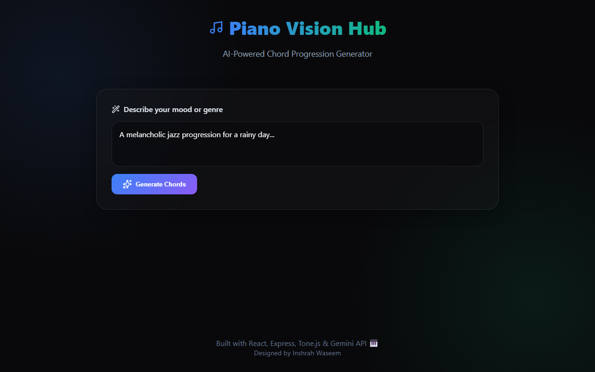

# 🎹 Piano Vision Hub

> **An AI-powered chord progression generator and virtual piano.**
> Describe your mood, and let the Gemini AI compose the perfect chord progression for you. Play it back instantly on a sleek, glassmorphic virtual piano.

---

## 📸 Application Preview


*Entering a mood to generate a custom chord progression.*


*Playing back the generated progression on the virtual piano in real-time.*

---

## 🚀 Features

- **AI Composition**: Uses Google's Gemini 2.5 Flash AI to generate accurate, music-theory-backed chord progressions based on any prompt.
- **Virtual Playback**: Integrated with `Tone.js` to play back the generated chords with a beautiful polyphonic synthesizer.
- **Glassmorphic UI**: A premium dark-mode interface featuring dynamic radial gradients and frosted glass panels.
- **Interactive Piano**: Visualizes the active notes being played on a responsive virtual piano keyboard.
- **Full-Stack Architecture**: Clean separation between a Vite React frontend and an Express.js Node backend.

---

## 🛠️ Tech Stack

### Frontend
- **React 18** (Vite)
- **TypeScript**
- **Tone.js** (Web Audio API synthesis)
- **Framer Motion** (Fluid animations)
- **Lucide React** (Icons)
- **Vanilla CSS** (Custom CSS variables, Grid/Flexbox layouts)

### Backend
- **Node.js** & **Express**
- **TypeScript**
- **@google/genai** (Google Gemini SDK)
- **CORS** & **Dotenv**

---

## 🚦 Getting Started

### Prerequisites
- Node.js (v18+)

### 1. Setup the Backend
Navigate to the `backend` directory:
```bash
cd backend
npm install
npm run dev
```

### 2. Setup the Frontend
Open a new terminal and navigate to the `frontend` directory:
```bash
cd frontend
npm install
npm run dev
```

### 3. Usage
Open your browser to the live app at `https://piano-vision-hub.vercel.app`. Describe the vibe or genre you want, hit "Generate Chords", and press "Play" to hear the AI composition!

---

## 👤 About the Author

**Inshrah Waseem**
- **Live Demo**: [https://piano-vision-hub.vercel.app](https://piano-vision-hub.vercel.app)
- Built as a demonstration of Web Audio synthesis and Generative AI integration.

---
*If you find this project helpful or interesting, feel free to drop a ⭐!*
